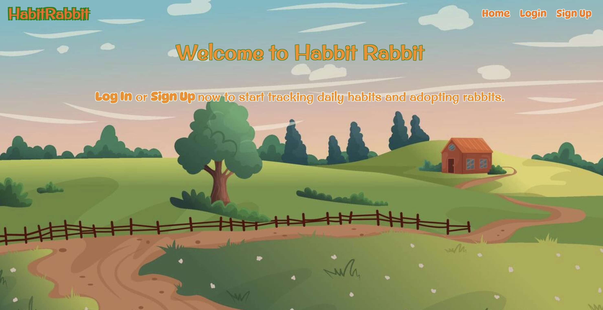

# Habit Rabbit
### https://habitrabbit-4c12e5279299.herokuapp.com/

## Description
Habit Rabbit is a daily habit tracking app that encourages users to keep habits alive. Users can create/adopt different habit rabbits, and collect acheivements after a certain amount of completions in a row. 

## Technologies Used
- HTML5
- CSS3
- Python
- Django
- PostgreSQL
  
## Planning
### Trello
[https://trello.com/b/SFbDCj28/matchinggame](https://trello.com/b/9Fw6q2Oi/habittracker)

## Next Steps
In the future, I'd like to expand user achievements after record completions. I'd also like to make the habit form a bit more customizable, with the ability to change how many times a day the user would like to complete the habit.
